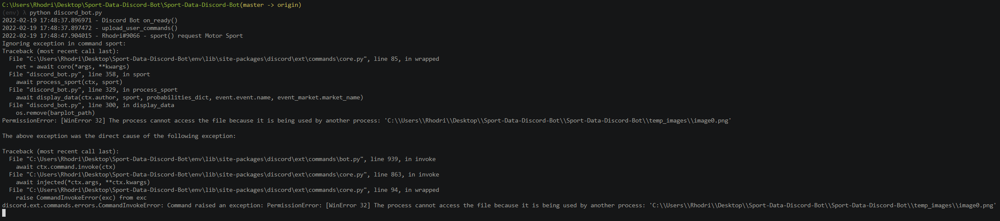

# Sport Data Discord Bot

## About

https://user-images.githubusercontent.com/52254823/216721412-1ab6a379-bef6-4be8-a280-37a2571c72eb.mp4

### Using bot

The bot is currently deployed and accessible to anyone. You can test the bot out for yourself by adding it to your server through this [invite link](https://discord.com/api/oauth2/authorize?client_id=877412844398837800&permissions=0&scope=bot) and messaging `!commands` to it in PMs.

### Data Sources

This bot utilises live [BetFair Exchange](https://www.betfair.com.au/exchange/plus/) betting data.

For this bot to function correctly I do collect some data from the users such as their last valid request. With this in mind I have created the means for the user to view their data `!my_data` and further more delete it from storage `!delete_data`.

## Python and Dependencies

### Python Version

This project is using `Python 3.7.0`.

### Dependencies

The list of dependencies for this project can be found in `requirements.txt` and can be installed using `pip install -r requirements.txt`. To build a new `requirements.txt` delete the old version, navigate to directory and run `pip freeze > requirements.txt`.

## Known Issues

### Local Permission Error

Running the application locally will throw the error shown below.

This will not occur when hosted live. It can be ignored but if you want to run it locally error free then comment out `os.remove(barplot_path)` and `os.remove(piechart_path)`.

## Running

### AWS

Pushing to the `master` branch will automatically cause the bot to refresh with the changes applied.

**Ensure keys and user commands JSON are populated in connected Amazon S3 bucket.**

**Do not delete `Procfile` and do not delete `.ebextensions` both are responsible for the running of the program, that is avoiding timeouts and restarting the instance daily (avoiding errors) accordingly.**

As seen throughout the scripts, keys and secrets are all stored as environment variables in AWS.

### Discord

You can access and use the bot by visiting [this link](https://discord.com/api/oauth2/authorize?client_id=877412844398837800&permissions=0&scope=bot) and adding it to your server. Message it `!commands` in PMs to get usage instructions.
